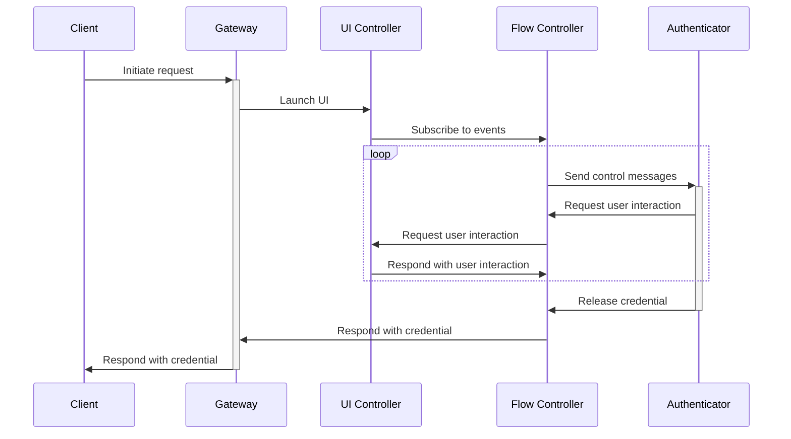

# Overview

These APIs are organized by profile and then by callers.

Profiles are groups of API methods that credential portal implementations can
adopt. The base profile MUST be implemented.

The method groups:
- Public: methods that portal clients can call, implemented by the portal frontend
- Internal, Frontend: methods that portal frontends need to provide for the backend to call
- Internal, Backend: methods that portal backends need to provide for the frontend to call

// TODO: We need some sort of discovery method for the profiles. Would getClientCapabilities suffice?

# Terminology

authenticator: a device that securely stores and releases credentials
client: a user agent requesting credentials for a relying party, for example, browsers or apps
credential: a value that identifies a user to a relying party
gateway: entrypoint for clients
privileged client: a client that is trusted to set any origin for its requests
relying party: an entity wishing to auhtenticate a user
unprivileged client: a client that is constrained to use a predetermined set of origin(s)

# API Overview

There are three main API defined by this specification:
- Gateway API
- Flow Control API
- UI Control API

The Gateway is the entrypoint for clients to interact with. The Flow
Controler and UI Controller work together to guide the user through the
process of selecting an appropriate credential based on the request received by
the Gateway.

The UI Control API is used to launch a UI for the user to respond to
authenticator requests for user interaction. The Flow Controller mediates
authenticator requests for user interaction. The UI Controller and Flow
Controller pass user interaction request and action messages back and forth
until the authenticator releases the credential. Then, the Flow Controller
sends the credential to the Gateway, which relays the credential to the client.

Here is a diagram of the intended usage and interactions between the APIs.

# Gateway API

The Gateway is the entrypoint for public clients to retrieve and store
credentials and is modeled after the Web
[Credential Management API][credman-api].

It is responsible for authorizing client requests for specific origins and for
validating request parameters, for example, validating the binding between
origins and relying party IDs for public key credential requests.

[credman-api]: https://w3c.github.io/webappsec-credential-management/

## `CreateCredential(credRequest CreateCredentialRequest) -> CreateCredentialResponse`

`CreateCredential()` is the way that new credentials are created. The
`credRequest` parameter defines the client's context as well as the parameters
for what kind of credential the client would like to create.

### Request
CreateCredentialRequest[a{sv}] {
    origin: string
    is_same_origin: string
    type: CredentialType
    <extra_fields>
}

CredentialType[s] [
    "publicKey"
]

#### Request context
// TODO: replace is_same_origin with topOrigin, required if origin is set.
// TODO: Should we say that `origin` will be optional in the future?
// TODO: Define methods for safe comparison of hosts Punycode origins.

`origin` and `is_same_origin` define the request context. Both are required. A
request is considered to be a cross-origin request if `is_same_origin` is
`false`. For certain credentials, cross-origin requests are not allowed and
will be denied.

At this time, only [web origins][web-origins] with HTTPS schemes are permitted
for the `origin`, for example, `https://example.com`. No Unicode characters or
Punyode are currently permitted.

The origin must be a registrable domain, not a top-level domain nor a public
suffix, as defined by the [Public Suffix List][PSL].

[web-origins]: https://html.spec.whatwg.org/multipage/browsers.html#concept-origin-tuple
[PSL]: https://github.com/publicsuffix/list

#### Credential Types
// TODO: decide on case of strings (snake_case like D-Bus or camelCase like JS?)

Currently, there is only one supported type of `CreateCredentialRequest`,
`CreatePublicKeyCredentialRequest`, identified by `type: "publicKey"` and
corresponds to WebAuthn credentials:

    CreatePublicKeyCredentialRequest[a{sv}] : CreateCredentialRequest {
        origin: string
        is_same_origin: string
        type: "publicKey"
        publicKey: CreatePublicKeyCredentialOptions[a{sv}] {
            // WebAuthn credential attestation JSON
            request_json: String
        }
    }

`request_json` is a string of JSON that corresponds to the WebAuthn
[`PublicKeyCredentialCreationOptions`][def-pubkeycred-creation-options]
type.

### Response
// TODO: Should we group common types in their own section for reference?
//       CredentialType will be referenced in the request and response of both create
//       and get methods.

`CreateCredentialResponse` is a polymorphic type that depends on the type of
the request sent. Its `type` field is a string specifies what kind of
credential it is, and what `<extra_fields>` should be expected.

CreateCredentialResponse[a{sv}] {
    type: CredentialType
    <extra_fields>
}

`CredentialType` is defined above.

As the only supported request is `CreatePublicKeyCredentialRequest`, the only
type of response is CreateCredentialResponse is CreatePublicKeyResponse, also
denoted by `type: "publicKey"`:

    CreatePublicKeyResponse {
        type: "publicKey"
        registration_response_json: String
    }

`registration_response_json` is a JSON string that corresponds to the WebAuthn
[`PublicKeyCredential`][def-pubkeycred] with the `response` field set as an
[`AuthenticatorAttestationResponse`][def-attestation-response].

[def-pubkeycred]: https://www.w3.org/TR/webauthn-3/#publickeycredential
[def-pubkeycred-creation-options]: https://www.w3.org/TR/webauthn-3/#dictdef-publickeycredentialcreationoptions
[def-attestation-response]: https://www.w3.org/TR/webauthn-3/#authenticatorattestationresponse

### Errors

TBD.

## `GetCredential(credRequest GetCredentialRequest) -> GetCredentialResponse`

`GetCredential()` is how credentials are retrieved. The `credRequest` parameter
defines the client's context as well as the parameters for what types of
credentials the client will accept.

### Request

GetCredentialRequest[a{sv}] {
    origin: string
    is_same_origin: string
    publicKey: GetPublicKeyCredentialOptions?
}

Note that while only one credential type can be specified in
`CreateCredential()`, credential types in this `GetCredential()` are not mutually
exclusive: as new credential types are added to the specification, a client may
request multiple different types of credentials at once, and it can expect the
returned credential to be any one of those credential types. Because of that,
there is no `type` field, and credential types are specified using the optional fields.

#### Request Context

The `GetCredential()` `origin` and `is_same_origin` have the same semantics and
restrictions as in `CreateCredential()` described above.

When multiple credential types are specified, the request context applies to
all credentials.

#### Credential Types
// TODO: decide on case of strings (snake_case like D-Bus or camelCase like JS?)

Currently, there is only one supported type of credential, specified by the
`publicKey` field, which corresponds to WebAuthn credentials and takes a
`GetPublicKeyCredentialOptions`:

GetPublicKeyCredentialOptions[a{sv}] {
    request_json: string
}

`request_json` is a string of JSON that corresponds to the WebAuthn
[`PublicKeyCredentialRequestOptions`][def-pubkeycred-request-options].

[def-pubkeycred-request-options]: https://www.w3.org/TR/webauthn-3/#dictdef-publickeycredentialrequestoptions

### Response
// TODO: Should we group common types in their own section for reference?
//       CredentialType will be referenced in the request and response of both create
//       and get methods.

`GetCredentialResponse` is a polymorphic type that depends on the type of the
request sent. Its `type` field is a string specifies what kind of credential it
is, and what `<extra_fields>` should be expected.

GetCredentialResponse[a{sv}] {
    type: CredentialType
    <extra_fields>
}

`CredentialType` is defined above.

As the only supported request is `CreatePublicKeyCredentialRequest`, the only
type of response is CreateCredentialResponse is CreatePublicKeyResponse, also
denoted by `type: "publicKey"`:
    GetPublicKeyCredentialRepsonse {
        type: "publicKey"
        publicKey: {
            // WebAuthn credential assertion response JSON
            authentication_response_json: string
        }
    }

`authentication_response_json` is a JSON string that corresponds to the WebAuthn
[`PublicKeyCredential`][def-pubkeycred] with the `response` field set as an
[`AuthenticatorAssertionResponse`][def-assertion-response].

[def-pubkeycred]: https://www.w3.org/TR/webauthn-3/#publickeycredential
[def-pubkeycred-creation-options]: https://www.w3.org/TR/webauthn-3/#dictdef-publickeycredentialcreationoptions
[def-assertion-response]: https://www.w3.org/TR/webauthn-3/#authenticatorassertionresponse

### Errors

TBD.

## `GetClientCapabilities() -> GetClientCapabilitiesResponse`

Analogous to WebAuthn Level 3's [`getClientCapabilities()`][def-getClientCapabilities] method.

### Response

`GetClientCapabilitiesResponse` is a set of boolean flags indicating what features this client supports.

    GetClientCapabilitiesResponse[a{sb}] {
        conditional_create: bool,
        conditional_get: bool,
        hybrid_transport: bool,
        passkey_platform_authenticator: bool,
        user_verifying_platform_authenticator: bool,
        related_origins: bool,
        signal_all_accepted_credentials: bool,
        signal_current_user_details: bool,
        signal_unknown_credential: bool,
    }

See the WebAuthn spec for meanings of the [client capability keys][def-client-capabilitities].

[def-client-capabilities]: https://www.w3.org/TR/webauthn-3/#enumdef-clientcapability
[def-getClientCapabilities]: https://w3c.github.io/webauthn/#sctn-getClientCapabilities

# Flow Control API

The Flow Control API is used by the UI to pass user interactions through the Flow Controller to the authenticator.

## GetAvailablePublicKeyDevices() -> CredentialMetadata[]
// TODO: Should we add displayName and username as optional fields for
// individual credential "devices"

// TODO: I don't like the term "devices" here, since many of these are not what
// you would normally think as devices. Maybe "sources" works better?

This retrieves the various "devices" that the user can choose from to fulfill
the request, filtered by the request origin and other request options.

The word "devices" is used broadly and can refer to individual authenticators
(like a locked passkey provider or linked hybrid device), a group of
authenticators on a transport (USB or hybrid QR code devices), or even an
individual credential (in the case of credentials supplied by unlocked passkey
providers).

    CredentialMetadata[a{sv}] {
        id: string,
        transport: Transport
    }

    Transport[s] [
        "ble",
        "hybrid_linked",
        "hybrid_qr",
        "internal",
        "nfc",
        "usb",
    ]

### `SelectCredential(session Session, id String) CompletionToken`

Send the ID of the credential that the user selected. Returns a token that can
be used to call CompleteTransaction().

### `CompleteTransaction()`

Backend is done with the request, called after `SelectCredential()`.
Frontend will continue with sending the selected result to the client.

// TODO: Is this necessary? I thought it might be useful to allow for the UI to
control window cleanup and whatnot, but maybe that can just be done at the
end of `SelectCredential()`.

### `CancelRequest()`

Cancels the current request, cleaning up any resources held by the frontend for the request.

// TODO: Does this need a reason, e.g. user cancelled, or will it always just be
user cancelled?

## Internal, Backend

### `GetCredential(origin String, types: String[])`

TODO: This needs some work. The backend needs to know the type to know what to
display. E.g. "Select a password" vs. "This will use your device credentials".

### NotifyFingerprint()

// TODO: I don't know if this needs to be here. Maybe a callback in
StartFingerprintAuth() would be better? Or if this is needed, maybe a generic
`Notify()` method that takes a type would be better instead?

# Platform Authenticator profile

## Internal, Frontend

## Internal, Backend

# Provider profile

## Internal, Frontend

## Internal, Backend

# General Questions

Is D-Bus a secure transport, or do values need to be encrypted across D-Bus?

# Related Works

## Secret Service API

The Secret Service API is allows client applications to store secrets securely
in a service running in the user's login session. Secret data may be stored in
any format that the client application wishes. This makes secrets very flexible,
and applications can use them in many protocols like authentication (passwords,
JWT) or encryption (secure file or messages).

Credentials can be thought of as a subset of secrets that are constrained to a
particular format and protocol in order for users to authenticate to relying
parties interoperably. This way, relying parties do not need to create bespoke
authentication methods, and the user's device can offer a consistent user
interface.

So the Credentials API differs from the Secret Service API in two main ways:
- It supports specific credential formats (e.g. WebAuthn/FIDO2 credentials),
  rather than general secrets.
- It is primarily focused on authenticating to relying parties.
- It encourages interactive authentication and user intent, where Secret Service
  enables silent secret usage.
- It supports communicating with authenticators over several transports, not
  just secure storage.

So the two APIs are independently useful, but can work well together: for
example, an authenticator can be built using the Secret Service API.

## WebAuthn/Web Credential Management API

The Credential API mimics the Web Credential Management API which is used by
WebAuthn. It is the intent for the Credential API to support multiple types of
credentials, like passwords, TOTP, and digital credentials, but at this time
the specification only supports public key/WebAuthn credentials. in tur

The implementation of WebAuthn credentials is heavily inspired by the WebAuthn
API for Android.
